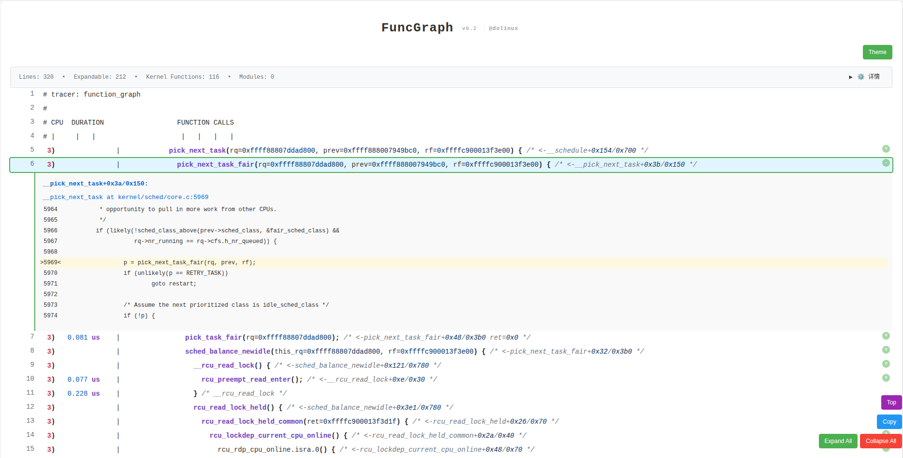

# FuncGraph



## Introduction

FuncGraph is a powerful ftrace visualization tool developed with **AI assistance**, primarily designed for:

1. **Visualizing funcgraph-retaddr output**: Converts the output of the Linux kernel's function_graph tracer into an interactive HTML format, significantly improving the efficiency of locating code lines directly through traces.
2. **Fast faddr2line implementation**: Rewrote the faddr2line functionality in the Linux kernel using Python, achieving an order-of-magnitude improvement in processing performance.

## Features

- **Interactive HTML output**: Click on functions to jump to the corresponding source code location
- **Kernel module support**: Parses symbol information of kernel modules
- **Source code linking**: Supports setting a base-url to directly link to online code repositories (e.g., bootlin)
- **Multiple module URL support**: Supports setting different source code URLs for different modules
- **High-performance processing**: fastfaddr2line.py is several orders of magnitude faster than the traditional addr2line approach
- **Flexible parameter configuration**: Supports specifying vmlinux, kernel source code, module directories, etc.

## Environment Requirements

- Python 3.6+
- gawk (used for certain data processing functions)
- addr2line tool (usually installed with binutils)
- ELF analysis library (optional, for fastfaddr2line.py)

## Installation

```bash
# Clone the repository
git clone https://gitee.com/pengdonglin137/funcgraph_visualization.git
cd funcgraph_visualization

# Ensure scripts have executable permissions
chmod +x *.py
```

## Usage

### Parameter Description

```bash
./funcgraph.py -h
```

Parameter explanation:
- `ftrace_file`: Path to the ftrace output file (required)
- `--vmlinux VMLINUX`: Path to the vmlinux file
- `--kernel-src KERNEL_SRC`: Root directory of the kernel source code
- `--module-dirs [MODULE_DIRS ...]`: Kernel module search directories
- `--module-srcs [MODULE_SRCS ...]`: Module source code root directories (can specify multiple paths)
- `--base-url BASE_URL`: Base URL for source code links
- `--module-url MODULE_URL`: Module URL mapping (can be specified multiple times, format: url:mod1,mod2)
- `--output OUTPUT`: Path to the output HTML file
- `--auto-search`: Automatically search common module directories
- `--verbose`: Enable detailed debug output
- `--fast`: Use fastfaddr2line.py to process vmlinux
- `--use-external`: Force use of external faddr2line
- `--highlight-code`: Enable C source code syntax highlighting (requires Pygments)
- `--path-prefix [PATH_PREFIX ...]`: Alternative path prefixes (can specify multiple paths)

### Usage Examples

#### Basic Usage

```bash
./funcgraph.py --fast --vmlinux /home/pengdl/work/linux-6.18/vmlinux \
    --kernel-src /home/pengdl/work/linux-6.18 \
    --module-dirs /home/pengdl/work/linux-6.18/modules_install/ \
    --base-url https://elixir.bootlin.com/linux/v6.18/source \
    --output output.html ftrace.txt
```

#### Using Multiple Module URLs

Set different source code URLs for different modules:

```bash
./funcgraph.py --fast --vmlinux /home/pengdl/work/linux-6.18/vmlinux \
    --kernel-src /home/pengdl/work/linux-6.18 \
    --base-url https://elixir.bootlin.com/linux/v6.18/source \
    --module-url https://url1.com:mod1,mod2 \
    --module-url https://url2.com:mod3,mod4 \
    --module-url https://default.com \
    --output output.html ftrace.txt
```

Explanation:
- `mod1,mod2` use `https://url1.com`
- `mod3,mod4` use `https://url2.com`
- Other modules use `https://default.com`
- If no default URL is specified, `--base-url` will be used

#### Enable Syntax Highlighting

```bash
./funcgraph.py --fast --vmlinux /home/pengdl/work/linux-6.18/vmlinux \
    --kernel-src /home/pengdl/work/linux-6.18 \
    --base-url https://elixir.bootlin.com/linux/v6.18/source \
    --highlight-code \
    --output output.html ftrace.txt
```

#### Using fastfaddr2line Independently

```bash
# View help
./fastfaddr2line.py -h

# Parse a single address
./fastfaddr2line.py vmlinux arch_stack_walk+0x150/0x4a8
```

#### Using Cross-Compilation Toolchain

For cross-compiled kernels, you can use the `CROSS_COMPILE` environment variable to specify the toolchain prefix:

```bash
# Set cross-compilation prefix
export CROSS_COMPILE=aarch64-linux-gnu-

# Use fastfaddr2line to parse addresses
./fastfaddr2line.py vmlinux arch_stack_walk+0x150/0x4a8

# Or use funcgraph.py to generate HTML
./funcgraph.py --fast --vmlinux vmlinux \
    --kernel-src /path/to/kernel \
    --base-url https://elixir.bootlin.com/linux/v6.18/source \
    --output output.html ftrace.txt
```

Note:
- The `CROSS_COMPILE` environment variable is automatically passed to the underlying `addr2line` tool
- Ensure the cross-compilation toolchain is installed and available in PATH
- The toolchain prefix does not need to include the trailing `-`, the script will add it automatically

## Method to Capture Traces

Execute the following commands on a Linux system to capture function_graph traces:

```bash
# Enter the tracing directory
cd /sys/kernel/tracing

# Stop current tracing
echo 0 > tracing_on

# Enable function return address tracing (**required**)
echo 1 > options/funcgraph-retaddr
# Enable function return value tracing (optional)
echo 1 > options/funcgraph-retval
# Enable function argument tracing (optional)
echo 1 > options/funcgraph-args

# Set the function_graph tracer
echo function_graph > current_tracer

# Start tracing (stop after running for 1 second)
echo 1 > tracing_on; sleep 1; echo 0 > tracing_on

# Save the trace results
cat trace > ~/ftrace.txt
```

## Project Structure

```
funcgraph_visualization/
├── README.md                    # Chinese documentation
├── README.en.md                 # English documentation
├── funcgraph.py                 # Main program: convert ftrace to HTML
├── fastfaddr2line.py            # High-performance address parsing tool
├── ftrace.txt                   # Example trace data
├── sample.png                   # Screenshot of output effect
└── sample.html                  # Example HTML output
```

## Working Principle

1. **Parse ftrace output**: funcgraph.py parses trace data in function_graph format
2. **Extract function addresses**: Retrieve the return address of each function from the trace
3. **Symbol resolution**: Convert addresses to source code locations using fastfaddr2line or addr2line
4. **Generate HTML**: Build an interactive HTML page showing function call relationships and source code

## Reference Articles

- [Ftrace Visualization Tool Gets Major Upgrade](https://mp.weixin.qq.com/s/xRVVgF5IDnLXGu2i-TbS5Q)
- [Ftrace Visualization Tool (Continued)](https://mp.weixin.qq.com/s/Mq8uTR3c8V1gAR2zklsFPw)
- [Wrote an ftrace Visualization Tool with Click-to-Jump Support](https://mp.weixin.qq.com/s/rNiWXC8YlZiAjfcjv7QtQA)

## License

This project is licensed under an open-source license. For detailed information, please refer to the LICENSE file in the repository.

## Contribution

Issues and Pull Requests are welcome to improve this project.